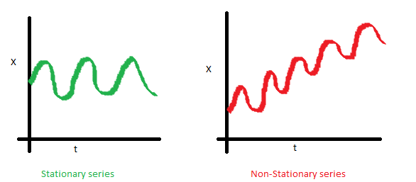
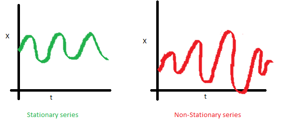
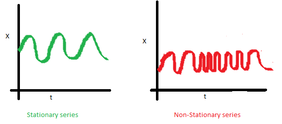

.. _header-n0:

R 时间序列建模
==============

.. _header-n3:

概述
----

-  时间序列分析和时间序列建模是强大的预测工具

-  在时间序列建模之前，时间序列背后的统计理论的先验知识是非常有用的

-  ARMA 和 ARIMA 是执行时间序列分析的重要模型

   -  AR

   -  MA

   -  ARMA

   -  ARIMA

.. _header-n20:

介绍
----

这里讨论的是预测和预测方法，处理基于时间的数据的一种方法是时间序列建模。顾名思义，它涉及按时间(年、月、日、小时、分钟、秒)为基础的数据，从而获得隐藏在数据中的见解，做出明智的决策。

当具有串行相关数据时，时间序列模型是非常有用的模型。大多数商业公司使用时间序列数据分析下一年的销售数据、网站流量、竞争位置等。

.. _header-n23:

内容
----

1. 基础知识-时间序列建模

2. R 中时间序列数据的探索

3. ARMA 时间序列建模简介

4. ARIMA 时间序列建模的框架与应用

.. _header-n33:

1.基础知识-时间序列模型
-----------------------

-  Stationary Seies(平稳序列)

-  Random walks(随机游走)

-  Rho Coefficient(Rho 系数)

-  Dickey Fuller Test of Stationarity(平稳性检验)

.. _header-n43:

1.1 平稳序列
~~~~~~~~~~~~

时间序列被归类为平稳序列有三个基本标准：

1. 时间序列的平均值不应该是时间的函数，而应该是一个常数；

2. 时间序列的方差不应该是时间的函数，这个性质称为同方差性；

3. 时间序列第 :math:`i` 项和第 :math:`i+m`
   项的协方差不应该是时间的函数；

为什么关心时间序列的“平稳性”？

除非你的时间序列平稳的，否则你无法建立时间序列模型。在违反平稳标准的情况下，第一个必要条件是对时间序列进行修正，然后尝试随机模型来预测该时间序列。有多种方法可以实现这种平稳性。其中一些是\ **去趋势(Detrending)**\ ，\ **差分(Differencing)**\ 等。

.. _header-n57:

1.2 随机游走
~~~~~~~~~~~~

假设一个女孩在一个巨大的棋盘上随机移动，在这种情况下，女孩的下一个位置取决于最后的位置。现在想象一下，你坐在另一个房间，却无法看到那个女孩。你想随时间预测女孩的位置，你有多准确？当然，随着女孩位置发生变化，你变得越来越不准确，在
:math:`t=0`
时，你确切地知道这个女孩在哪里，下一次，她只能移动到8个方格，因此你的概率下降到
:math:`\frac{1}{8}`\ ，并且随时间继续下降。

这里用数学公式表示这个现象：

:math:`X(t)=X(t-1)+Error(t)`

其中：\ :math:`Error(t)` 是时间点 :math:`t`
的误差，这时女孩在每个时间点带来的随机性

如果递归拟合所有的 :math:`X`\ ，得到：

:math:`X(t)=X(0)+(Error(1)+Error(1)+\ldots+Error(t))`

现在，尝试在这个随机游走公式中验证我们对平稳序列的假设：

**1.平均值是否恒定？**

:math:`E[X(t)]=E[X(0)]+(E[Error(1)]+E[Error(2)]+\ldots+E[Error(t)])`

假设任何错误的期望都是零，因为它是随机的，因此得到时间序列的均值是一个固定的值：

:math:`E[X(t)]=E[X(0)]`

**2.方差是否恒定？**

:math:`Var[X(t)]=Var[X(0)] + (Var[Error(1)] + Var[Error(1)] + \ldots +  Var[Error(t)])`

:math:`Var[X(t)]=t*Var(Error)`

因此，推断随机游走不是平稳过程(平稳序列)，因为它具有随时间变化的方差，此外，如果检查协方差，会发现协方差也取决于时间。

.. _header-n73:

1.3 Rho 系数
~~~~~~~~~~~~

在非平稳的随机游走方程中引入一个新的系数：Rho

:math:`X(t)=Rho * X(t-1)+Error(t)`

现在来改变 :math:`Rho` 系数的数值，来看下时间序列是否能够平稳下来。

对上面等式两边求期望：

:math:`E[X(t)]=Rho * E[X(t-1)]`

时间序列中下一个值 :math:`X` 被拉到 :math:`Rho` 乘以 :math:`X`
的上一个值(\ :math:`X` 的最后一个值)

.. _header-n81:

1.4 Dickey Fuller Test of Stationarity(平稳性检验)
~~~~~~~~~~~~~~~~~~~~~~~~~~~~~~~~~~~~~~~~~~~~~~~~~~

:math:`X(t) = Rho * X(t-1)+Error(t)`

:math:`X(t)-X(t-1)=(Rho - 1)X(t-1) + Error(t)`

原假设：\ :math:`Rho - 1 \nq 0`\ ，如果原假设被拒绝，将得到一个平稳的时间序列，平稳检验以及将时间序列转换为一个平稳序列是时间序列建模中最关键的过程。

.. _header-n86:

2.R 和 Python 中的时间序列数据
------------------------------

   数据：1949 年至 1960 年每月国际航空公司乘客总数

.. code:: r

   # data
   data(AirPassengers)
   class(AirPassengers)
   start(AirPassengers)
   end(AirPassengers)
   frequency(AirPassengers)
   summary(AirPassengers)

   # Detailed Metrics
   plot(AirPassengers)
   abline(reg = lm(AirPassengers ~ time(AirPassengers)))

   cycle(AirPassengers)
   plot(aggregate(AirPassengers, FUN = mean))
   boxplot(AirPassengers ~ cycle(AirPassengers))

探索性数据分析初步结论：

1. 时间序列值的趋势明显表明\ ``#passengers``\ 一直在增加

2. 7月和8月的方差和均值明显高于其他月份

3. 尽管每个月的均值不同，但是他么的方差很小，因此，有季节性的因素影响时间序列，周期为12个月或更短

从数据的探索性分析中可以得到很多有用的信息，比如：时间序列是否平稳，并且根据数据的特点，心中已经有了一些对于预测模型的选择。

.. _header-n99:

3.ARMA 时间序列模型
-------------------

ARMA 模型通常用于时间序列建模，在 ARMA 模型中，AR 代表自回归，MA 代表
移动平均。并且，AR 和 MA
都不适用于非平稳时间序列，如果时间序列是非平稳序列，需要对序列进行平稳化处理，才能够应用时间序列模型进行建模预测。

.. _header-n101:

3.1 AR
~~~~~~

一个国家目前的 GDP :math:`x(t)` 取决于去年的 GDP
:math:`x(t-1)`\ 。假设国家一个财政年度的产品和服务总生产成本(GDP)取决于上一年的\ **制造业、服务业**\ 和\ **今年新设立的行业、工厂、服务**\ ，这种情况下
GDP 的主要组成部分是前者，即：

:math:`x(t) = \alpha * x(t-1) + \epsilon(t)`

其中：

-  :math:`x(t)` 代表今年产生的 GDP

-  :math:`x(t-1)` 代表去年产生的 GDP

-  :math:`\epsilon(t) 代表今年新产生的的 GDP`

这个公式称为：AR(1)
公式，其中(1)表示下一个序列值依赖于前一个序列值。\ :math:`\alpha`
是最小化误差函数来估计的参数值，\ :math:`x(t-1)` 将以相同的方式与
:math:`x(t-1)` 建立关系，因此，\ :math:`x(t)` 的任何变动将越来越小。

.. _header-n114:

3.2 MA
~~~~~~

假设某制造商生产某种类型的包装袋，这种袋子在市场上很容易买到。作为一个竞争激烈的市场，突然该厂商的袋子销售量连续很多天都是零，所以该制造商在某一天设计了一个实验，并制作了几种不同类型的的袋子，这种袋子在市场中其他厂商没有在卖，所以，该厂商在某一天一下卖出了1000个的全部库存(\ :math:`x(t)`)。由于需求大于供应，所以，大约有100个顾客没有买到这种袋子，将这个销售缺口值表示为该时间点销售误差，随着时间的推移，这种袋子已经失去了

:math:`x(t) = \beta * \epsilon(t-1) + \epsilon(t)`

.. _header-n117:

3.3 ACF 和 PACF 图
~~~~~~~~~~~~~~~~~~

当得到平稳的时间序列后，必须回答两个主要的问题：

1. AR or MA?

2. 

.. _header-n125:

3.3 ARMA
~~~~~~~~

AR 和 MA
模型之间的主要区别是基于不同时间点的时间序列对象之间的相关性。对于

.. _header-n130:

4.ARIMA 时间序列模型
--------------------

如何进行时间序列分析：

1. Visualize the time series

2. Stationarize the series

3. Plot ACF/PACF charts and find optimal parameters

4. Build the ARIMA model

5. Make Predictions
