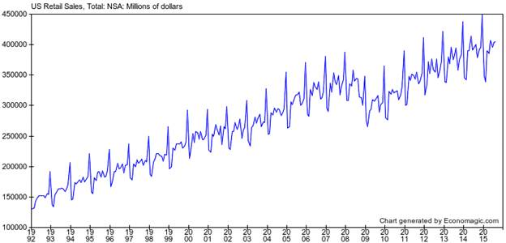

.. _header-n0:

时间序列分析教程
================

.. _header-n3:

1.Get to know your data
-----------------------

.. _header-n4:

1.1 了解数据
------------

-  数据从哪来？

-  数据有没有进行过调整、转换？

-  数据质量如何？

-  数据以什么单位进行测量的？

.. _header-n14:

1.2 了解数据中包含的信息
------------------------

下面的示例图是1992年到2015年的美国的经济增长历史曲线图，数据以百万美元为单位，并且未根据通货膨胀因素进行调整，未进行季节性调整，数据来自\ http://economagic.com\ 。通过绘制这样的时间序列图，可以得到关于数据的非常重要的信息：

该时间序列图中表现出的定性特征有：

-  整体而言，有一个非常强劲的上升趋势(upward
   trend)，这时由于通货膨胀增长和实际增长结合的作用；

-  2008年大萧条(Great Recession)期间出现了大幅下降(huge drop)；

-  有一个非常明显的季节性模式(seasonal variation)；

-  季节性变化的幅度大致与销售水平成比例增长，也就是说，随着时间的推移，它似乎在百分比而非绝对值条件下保持一致(这时一种所谓的“乘法(multiplicative)”季节性模式,
   这是经济活动中非常典型的模式)；

..

   A forecasting model for this time series must accommodate all these
   qualitative features, and ideally it should shed light on their
   underlying causes. To study these features of the time series in more
   depth, and to help determine which kind of forecasting model is most
   appropriate, we should next plot some transformations of the original
   data.

.. _header-n30:

1.3 通货膨胀调整(Inflation adjustment)
--------------------------------------

通货膨胀调整 (Inflation adjustment) 或通货紧缩调整(Deflation adjustment)
是通过将货币时间序列除以价格指数（例如消费者价格指数（CPI））来实现的。收缩的时间序列以“恒定美元”来衡量，而原始系列则以“名义美元”或“当前美元”来衡量。通货膨胀通常是以美元（或日元，欧元，比索等）衡量的任何系列中明显增长的重要组成部分。通过调整通货膨胀，你可以发现真正的增长。还可以稳定随机或季节性波动的方差和/或突出数据中的周期性模式。在处理货币变量时并不总是需要通货膨胀调整
- 有时用名义术语预测数据或使用\ **对数变换**\ 来稳定方差更简单 -
但它是分析经济数据的工具包中的重要工具。

常见的价格指数：

-  消费者价格指数

-  生产者价格指数

-  GDP物价平减指数

-  链式指数
